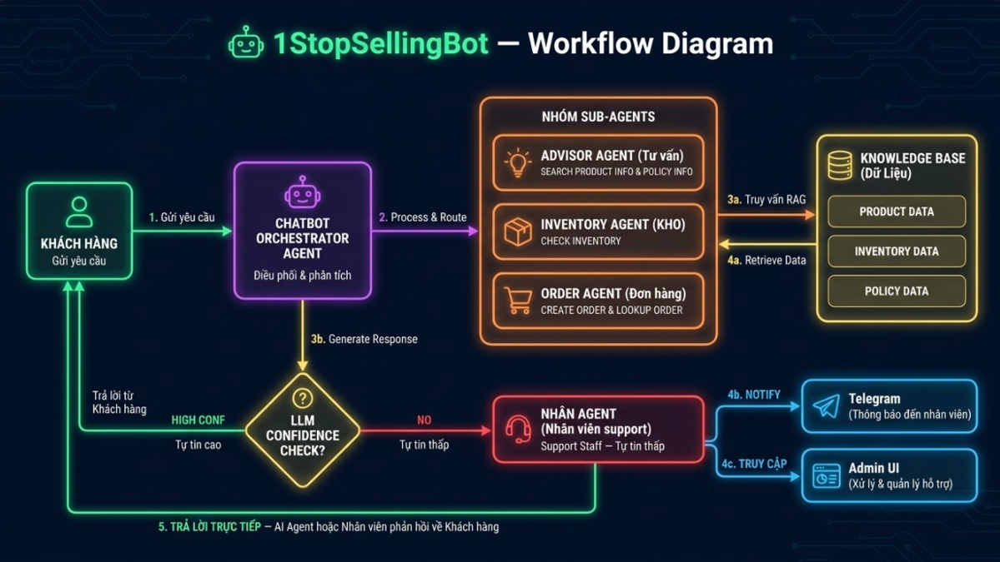

# 1StopSellingBot

Chatbot bán hàng AI đa tác nhân (multi-agent) tích hợp tìm kiếm ngữ nghĩa (RAG), quản lý đơn hàng, và chuyển tiếp nhân viên hỗ trợ theo thời gian thực.



---

## Tính năng

- **AI Chatbot** — Hệ thống đa tác nhân (Google ADK + Gemini 2.0 Flash) xử lý tư vấn sản phẩm, kiểm tra tồn kho, tạo đơn hàng
- **Tìm kiếm ngữ nghĩa (RAG)** — Trả lời dựa trên tài liệu nội bộ (chính sách, hướng dẫn) qua vector search với pgvector
- **Quản lý đơn hàng** — Tạo, tra cứu, cập nhật trạng thái đơn hàng
- **Quản lý tồn kho** — Theo dõi số lượng, cảnh báo hàng sắp hết
- **Human Escalation** — Chuyển tiếp cuộc hội thoại đến nhân viên phù hợp (theo kỹ năng), thông báo qua Telegram
- **Admin Dashboard** — Giao diện React quản lý sản phẩm, đơn hàng, nhân viên, tài liệu RAG, theo dõi hội thoại thời gian thực
- **WebSocket** — Nhân viên nhắn tin trực tiếp với khách hàng qua admin panel
- **Chat UI** — Giao diện Streamlit cho khách hàng

---

## Tech Stack

### Backend
| Thư viện | Vai trò |
|----------|---------|
| FastAPI + Uvicorn | REST API & ASGI server |
| Google ADK | Multi-agent orchestration |
| google-genai (Gemini 2.0 Flash) | LLM chính |
| LiteLLM + OpenRouter | LLM provider dự phòng |
| Supabase (PostgreSQL + pgvector) | Database & vector store |
| google text-embedding-004 | Tạo embedding (768 chiều) |
| aiogram | Telegram Bot |
| PyJWT + bcrypt | Xác thực nhân viên |
| Pydantic Settings | Quản lý cấu hình |

### Frontend
| Thư viện | Vai trò |
|----------|---------|
| React 19 + TypeScript + Vite | Admin Panel SPA |
| TanStack Router + React Query | Routing & server state |
| Tailwind CSS v4 + shadcn/ui | UI components |
| Zustand | Global state |
| Streamlit | Customer chat UI |

### DevOps / Tooling
- **uv** — Python package manager
- **pnpm** — Node package manager

---

## Cấu trúc project

```
1StopSellingBot/
├── app/
│   ├── main.py                  # FastAPI entry point
│   ├── config.py                # Settings & Supabase client
│   ├── agents/
│   │   ├── orchestrator.py      # Root agent (điều phối + escalation)
│   │   ├── advisor.py           # Tư vấn sản phẩm & RAG search
│   │   ├── inventory_agent.py   # Kiểm tra tồn kho
│   │   └── order_agent.py       # Tạo & tra cứu đơn hàng
│   ├── routers/                 # API endpoints
│   │   ├── chat.py
│   │   ├── products.py
│   │   ├── orders.py
│   │   ├── inventory.py
│   │   ├── rag.py
│   │   ├── staff.py
│   │   ├── escalation.py
│   │   ├── auth.py
│   │   └── ws.py
│   ├── services/                # Business logic
│   │   ├── rag.py               # Chunking & vector search
│   │   ├── embedding.py         # Google embedding API
│   │   ├── escalation.py        # Skill-based routing
│   │   ├── telegram.py          # Telegram notifications
│   │   └── websocket.py         # WebSocket manager
│   └── models/
│       └── schemas.py           # Pydantic request/response models
├── admin-ui/                    # React Admin Dashboard
│   └── src/
│       └── routes/              # Dashboard, conversations, staff, orders...
├── supabase/
│   └── migrations/              # SQL migration files (001–007)
├── docs/
│   ├── erd.svg                  # Entity Relationship Diagram
│   └── generate_erd.py
├── streamlit_app.py             # Customer chat UI
├── seed_data.py                 # Khởi tạo dữ liệu mẫu
├── benchmark_metrics.py         # Performance testing
├── pyproject.toml
└── makefile
```

---

## Yêu cầu hệ thống

- Python **3.12+**
- Node.js **18+** + pnpm
- Tài khoản [Supabase](https://supabase.com)
- Google AI API key ([Google AI Studio](https://aistudio.google.com))
- _(Tùy chọn)_ OpenRouter API key, Telegram Bot token

---

## Cài đặt

### 1. Cấu hình environment

```bash
cp .env.example .env
```

Chỉnh sửa `.env`:

```env
# Supabase
SUPABASE_URL=https://<project-ref>.supabase.co
SUPABASE_ANON_KEY=your_anon_key
SUPABASE_SERVICE_ROLE_KEY=your_service_role_key

# Google AI (LLM + Embedding)
GOOGLE_API_KEY=your_google_api_key

# OpenRouter (LLM dự phòng)
OPENROUTER_API_KEY=your_openrouter_key

# Telegram Bot (tùy chọn, dùng cho escalation notification)
TELEGRAM_BOT_TOKEN=your_telegram_bot_token

# Security
JWT_SECRET=change-me-in-production

# App
APP_ENV=development
APP_HOST=0.0.0.0
APP_PORT=8000
```

### 2. Khởi tạo database

Chạy lần lượt các file migration trong `supabase/migrations/` từ Supabase Dashboard → SQL Editor hoặc dùng Supabase CLI:

```
001_enable_pgvector.sql
002_create_core_tables.sql
003_create_search_functions.sql
004_create_low_stock_function.sql
005_grant_anon_access.sql
006_phase2_escalation_tables.sql
007_add_auth_fields_to_staff.sql
```

### 3. Cài dependencies

```bash
# Python
uv sync

# Admin UI
cd admin-ui && pnpm install
```

### 4. Seed dữ liệu mẫu

```bash
uv run python seed_data.py
```

Tạo: 5 sản phẩm, tồn kho, product embeddings, 3 tài liệu RAG (kèm chunks), 1 tài khoản admin.

---

## Chạy ứng dụng

```bash
# FastAPI server  →  http://localhost:8000
make server

# Streamlit chat UI  →  http://localhost:8501
make ui

# React admin panel  →  http://localhost:5173
make admin
```

Hoặc chạy thủ công:

```bash
uv run uvicorn app.main:app --reload --host 0.0.0.0 --port 8000
uv run streamlit run streamlit_app.py
cd admin-ui && pnpm run dev
```

---

## API Endpoints

| Method | Endpoint | Mô tả |
|--------|----------|-------|
| `POST` | `/api/chat` | Gửi tin nhắn đến chatbot |
| `GET` | `/api/products` | Danh sách sản phẩm |
| `POST` | `/api/products` | Tạo sản phẩm |
| `POST` | `/api/products/{id}/embed` | Tạo embedding cho sản phẩm |
| `POST` | `/api/products/embed-all` | Embed tất cả sản phẩm |
| `GET` | `/api/inventory` | Danh sách tồn kho |
| `POST` | `/api/inventory` | Upsert tồn kho theo SKU |
| `POST` | `/api/orders` | Tạo đơn hàng |
| `GET` | `/api/orders` | Danh sách đơn hàng |
| `POST` | `/api/rag/upload` | Upload & index tài liệu |
| `POST` | `/api/rag/sandbox/query` | Test RAG search |
| `GET` | `/api/staff` | Danh sách nhân viên |
| `POST` | `/api/escalations` | Yêu cầu chuyển tiếp nhân viên |
| `POST` | `/api/escalations/{id}/takeover` | Nhân viên nhận cuộc hội thoại |
| `POST` | `/api/escalations/{id}/reply` | Nhân viên nhắn tin |
| `POST` | `/api/escalations/{id}/resolve` | Đóng escalation |
| `POST` | `/api/auth/login` | Đăng nhập nhân viên |
| `WS` | `/api/ws/{session_id}` | WebSocket real-time |
| `GET` | `/docs` | Swagger UI |

---

## Database Schema

Xem chi tiết tại [docs/erd.svg](docs/erd.svg).

| Bảng | Mô tả |
|------|-------|
| `products` | Danh mục sản phẩm |
| `inventory` | Tồn kho theo SKU |
| `orders` | Đơn hàng |
| `order_items` | Chi tiết đơn hàng |
| `conversations` | Lịch sử hội thoại |
| `rag_documents` | Tài liệu nội bộ |
| `rag_chunks` | Chunks + vector embeddings (768d) |
| `product_embeddings` | Product vector embeddings (768d) |
| `staff` | Nhân viên hỗ trợ |
| `escalations` | Yêu cầu chuyển tiếp |

---

## Kiến trúc Multi-Agent

```
User Message
     │
     ▼
Orchestrator Agent
     │
     ├──► Advisor Agent       (RAG search, tư vấn sản phẩm)
     ├──► Inventory Agent     (kiểm tra tồn kho)
     ├──► Order Agent         (tạo & tra cứu đơn hàng)
     └──► Human Escalation    (chuyển tiếp nhân viên qua Telegram + WebSocket)
```
